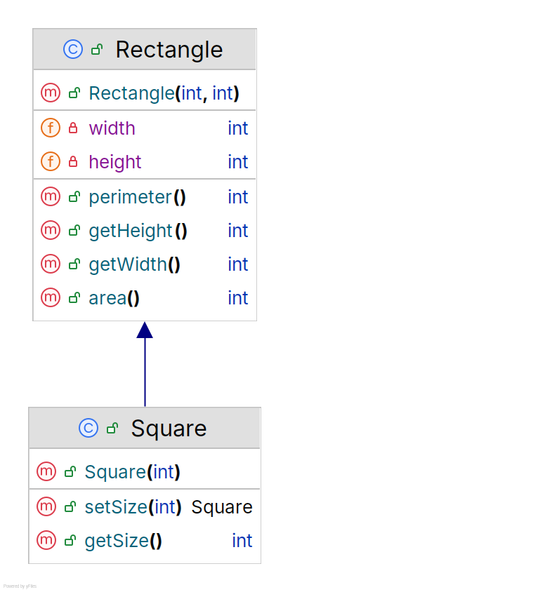

# Square, Rectangle and the Liskov Substitution Principle

This test aims at proving that, as opposed to what this [article](https://medium.com/@alex24dutertre/square-rectangle-and-the-liskov-substitution-principle-ee1eb8433106) states,
the class hierarchy shown in the diagram below:

is perfectly accurate because:

  - It doesn't violate the **Liskov Substitution Principle** (LSP).
  - It doesn't violate the **Single Responsibility Principle** (SRP).
  - It doesn't violate the **Open-Closed Principle** (OCP).

This implementation doesn't violate LSP:

  - The base `Rectangle` class is immutable and `Square` maintains this immutability.
  - The `setSize()` method returns a new `Square` instance rather than modifying the existing one, preserving immutability.
  - `Square` doesn't override any of `Rectangle` core behaviors (width, height, area, perimeter calculations)
  - The additional methods `getSize()` and `setSize()` don't alter or contradict Rectangle's behavior.
  - Any code that works with `Rectangle` will work correctly with `Square` without knowing it's a `Square`

The implementation doesn't violate SRP:

  - The `Square` class Has a single, clear purpose: representing a square.
  - All its methods are directly related to that purpose.
  - It has only one reason to change: if the way we represent or handle squares needs to change.
  - It maintains cohesion: all its methods work with the same data and serve the same purpose.

The implementation doesn't violate OCP:

  - The `Square` class is effectively closed for modification.
  - It extends `Rectangle` without modifying its behavior.
  - Its immutable design means core behaviors don't need to change.
  - New functionality can be added to it through:
    - Further extension (creating new subclasses of `Square` if needed)
    - Composition (using `Square` as part of other classes)
    - Adding new methods without changing existing ones.

## Testing and running

Testing with JUnit 5

### With Maven

    $ git clone https://github.com/nicolasduminil/square-rectangle-lsp.git
    $ cd square-rectangle-lsp
    $ mvn test

This should display a test report as shown below:

    [INFO] -------------------------------------------------------
    [INFO]  T E S T S
    [INFO] -------------------------------------------------------
    [INFO] Running fr.simplex_software.workshop.square_rectangle_lsp.tests.TestSquare
    [INFO] Tests run: 1, Failures: 0, Errors: 0, Skipped: 0, Time elapsed: 0.032 s -- in fr.simplex_software.workshop.square_rectangle_lsp.tests.TestSquare
    [INFO]
    [INFO] Results:
    [INFO]
    [INFO] Tests run: 1, Failures: 0, Errors: 0, Skipped: 0
    [INFO]
    [INFO] ------------------------------------------------------------------------
    [INFO] BUILD SUCCESS
    [INFO] ------------------------------------------------------------------------
    [INFO] Total time:  1.305 s
    [INFO] Finished at: 2024-12-16T18:50:36+01:00
    [INFO] ------------------------------------------------------------------------

### In the IntelliJ IDEA

In the `Project` pane, right click on the `TestSquare` class and select `Run TestSquare`

## Running with Maven

In command line mode:

    $ git clone https://github.com/nicolasduminil/square-rectangle-lsp.git
    $ cd square-rectangle-lsp
    $ mvn exec:java

This will display the result below:

    *** Printing data for Rectangle(10, 20)
      >>> Width: 10
      >>> Height: 20
      >>> Area: 200
      >>> Perimeter: 60
    *** Printing data for Square(10)
      >>> Width: 10
      >>> Height: 10
      >>> Area: 100
      >>> Perimeter: 40

## Running in IntelliJ IDEA

In the `Project` pane, right-click on the `Main` class and select `Run Main.main()`

